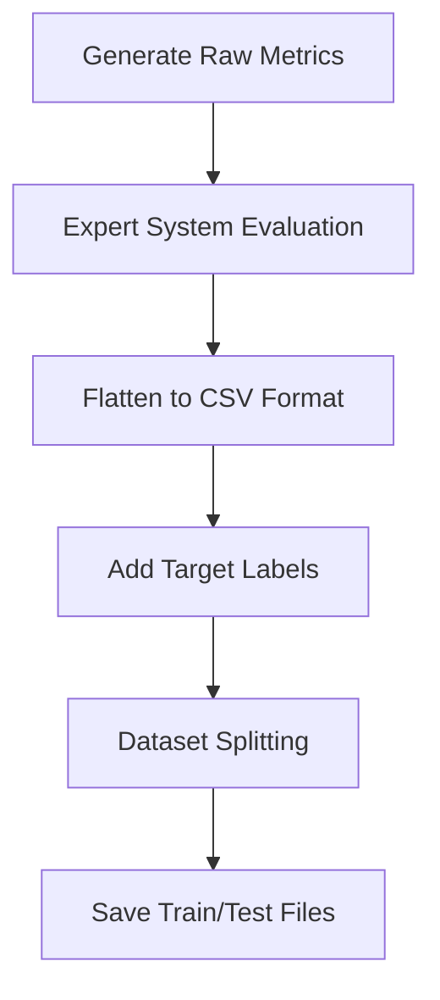

# Synthetic Data Generation Documentation

## Overview

This document provides an overview of the synthetic data generation system implemented in `data_generator.py`. The system creates realistic Windows security metrics for training machine learning models.

The synthetic data generation system generates diverse, realistic security scenarios that cover possible system configurations, enabling ML model training.

### Core Components

- **Metric Generators**: Functions for each security domain
- **Expert System Integration**: Leverages CLIPS evaluator for ground truth labels
- **Data Flattening**: Converts nested metrics to ML-friendly format
- **Dataset Management**: Handles splitting and saving
- **Command-Line Interface**: Provides dataset generation workflow

### Generation Pipeline



## Metric Generation Strategy

The system generates metrics using scenarios that represent real-world Windows configurations.

### Patch Status Generation (`generate_patch_metric()`)

Simulates Windows Update status with hotfix patterns:

```python
# Example outputs
{"status": "up-to-date", "hotfixes": ["KB5056579", "KB5048779"]}
{"status": "out-of-date", "hotfixes": []}
{"status": "out-of-date", "hotfixes": ["KB1234567", "KB2345678", "KB3456789"]}
```

**Generation Strategy:**

- **Current Systems**: Recent hotfixes with "up-to-date" status
- **Outdated Systems**: Older or missing hotfixes with "out-of-date" status
- **Mixed Scenarios**: Partial updates
- **Edge Cases**: Empty hotfix lists

### Network Port Generation (`generate_ports_metric()`)

Creates open port configurations across different system types:

```python
# Example scenarios
{"ports": []}                                    # Locked-down system
{"ports": [80, 443]}                            # Web server
{"ports": [135, 139, 445]}                      # Windows file sharing
{"ports": [21, 22, 23, 25, 53, 80, 110, ...]}  # High-risk configuration
```

**Port Categories:**

- **Web Services**: 80 (HTTP), 443 (HTTPS)
- **Windows Networking**: 135 (RPC), 139 (NetBIOS), 445 (SMB)
- **Remote Access**: 3389 (RDP), 5900 (VNC), 22 (SSH)
- **Database Services**: 5432 (PostgreSQL), 3306 (MySQL)
- **High-Risk Services**: 21 (FTP), 23 (Telnet), 25 (SMTP)

### Services Generation (`generate_services_metric()`)

Simulates Windows service configurations with service names and states:

```python
# Example service sets
{"services": []}  # Minimal system
{"services": [
    {"name": "Dnscache", "state": "running"},
    {"name": "Spooler", "state": "running"},
    {"name": "WinDefend", "state": "stopped"}    # Security issue
]}
```

**Service Categories:**

- **Critical Services**: DNS Cache, Event Log, RPC services
- **Security Services**: Windows Defender, Windows Firewall
- **Optional Services**: Print Spooler, Gaming services
- **Enterprise Services**: Domain controllers, SQL Server

**State Distribution:**

- Services are set to running or stopped.

### Firewall Configuration (`generate_firewall_metric()`)

Models Windows Firewall profile states across different network types:

```python
# Common configurations
{"profiles": {"domain": "ON", "private": "ON", "public": "ON"}}     # Secure
{"profiles": {"domain": "ON", "private": "ON", "public": "OFF"}}    # Public risk
{"profiles": {"domain": "OFF", "private": "OFF", "public": "OFF"}}  # Vulnerable
{"profiles": {"domain": "UNKNOWN", "private": "ON", "public": "ON"}}# Detection issue
```

**Profile Types:**

- **Domain**: Corporate network environment
- **Private**: Home/trusted network environment
- **Public**: Untrusted network environment

### Antivirus Status (`generate_antivirus_metric()`)

Simulates antivirus product detection and state information:

```python
# State codes based on Windows Security Center
{"products": [{"name": "Windows Defender", "state": 397568}]}  # Fully enabled
{"products": [{"name": "Windows Defender", "state": 262144}]}  # Disabled
{"products": []}                                               # No protection
```

**State Interpretation:**

- **397568**: Enabled
- **397312**: Enabled different config
- **262144**: Installed but disabled
- **UNKNOWN**: State could not be determined

### Password Policy (`generate_password_policy_metric()`)

Creates password policy configurations:

```python
# Policy strength variations
{"policy": {"min_password_length": 0, "max_password_age": 0}}    # No policy
{"policy": {"min_password_length": 8, "max_password_age": 60}}   # Basic security
{"policy": {"min_password_length": 12, "max_password_age": 90}}  # High security
```

**Policy Parameters:**

- **min_password_length**: 0-14 characters (0 = no minimum)
- **max_password_age**: 0-365 days (0 = never expires)

## Expert System Integration

The generation system leverages the CLIPS expert system to provide ground truth labels for each generated scenario.

### Evaluation Process

```python
def generate_dataset(expert_system, num_samples: int) -> List[Dict[str, Any]]:
    for i in range(num_samples):
        metrics = generate_single_metric_set()    # Generate raw metrics
        result = expert_system.evaluate(metrics)  # Get expert assessment
        row = flatten_metrics(metrics)            # Convert to ML format
        row["target_score"] = result["score"]     # Add score label
        row["target_grade"] = result["grade"]     # Add grade label
```

### Label Generation

The expert system provides two types of target labels:

- **target_score**: Numerical security score (0-100)
- **target_grade**: Categorical security grade

These labels represent the expert system's assessment and serve as training targets for ML models.

## Data Flattening and Feature Engineering

Raw metrics are transformed into a flat, ML-friendly format through the `flatten_metrics()` function.

### Feature Transformation

**Original Nested Structure:**

```python
{
    "patch": {"status": "up-to-date", "hotfixes": ["KB1", "KB2"]},
    "services": {"services": [{"name": "DNS", "state": "running"}]}
}
```

**Flattened ML Features:**

```python
{
    "patch_status": "up-to-date",
    "patch_hotfixes_count": 2,
    "services_total": 1,
    "services_running": 1,
    "services_stopped": 0
}
```

### Feature Categories

**Patch Features:**

- `patch_status`: Categorical (up-to-date, out-of-date)
- `patch_hotfixes_count`: Numerical (count of installed hotfixes)

**Network Features:**

- `ports_count`: Numerical (total open ports)

**Service Features:**

- `services_total`: Numerical (total services)
- `services_running`: Numerical (active services)
- `services_stopped`: Numerical (inactive services)

**Firewall Features:**

- `firewall_domain`: Categorical (ON, OFF, UNKNOWN)
- `firewall_private`: Categorical (ON, OFF, UNKNOWN)
- `firewall_public`: Categorical (ON, OFF, UNKNOWN)

**Antivirus Features:**

- `antivirus_count`: Numerical (number of AV products)
- `antivirus_enabled`: Binary (0 = disabled, 1 = enabled)

**Password Policy Features:**

- `password_min_length`: Numerical (minimum password length)
- `password_max_age`: Numerical (maximum password age in days)

**Target Variables:**

- `target_score`: Numerical security score
- `target_grade`: Categorical security grade

## Dataset Management

### Generation Parameters

The system supports configurable dataset generation:

```bash
# Basic generation
python -m src.data_generator -n 1000 -o security_dataset.csv

# Train/test split generation
python -m src.data_generator -n 5000 --split 0.8 -o security_data_split.csv
```

**Parameters:**

- `-n, --num_samples`: Number of samples to generate
- `-o, --output`: Output CSV filename
- `--split`: Train/test split ratio (0.8 = 80% train, 20% test)

### Output Files

**Single Dataset:**

- `security_dataset.csv`: Complete dataset with all samples

**Split Dataset:**

- `security_data_split_train.csv`: Training data (80% by default)
- `security_data_split_test.csv`: Testing data (20% by default)

### Data Quality Assurance

**Progress Monitoring:**

```bash
Generating 5000 samples...
Progress: 100/5000
Progress: 200/5000
...
Dataset generation complete.
```

**Sample Validation:**

```json
{
  "patch_status": "out-of-date",
  "patch_hotfixes_count": 0,
  "ports_count": 7,
  "services_total": 15,
  "services_running": 14,
  "services_stopped": 1,
  "firewall_domain": "ON",
  "firewall_private": "OFF"
}
```

## Cryptographic Security

The generation system uses the `secrets` module for cryptographically secure randomness, ensuring:

- **Unpredictable Patterns**: Scenarios cannot be predicted or reproduced
- **Statistical Independence**: Each sample is independently generated

```python
# Secure random selection
status = secrets.choice(["up-to-date", "out-of-date"])
ports = secrets.choice(port_strategies)
```

## Performance and Scalability

### Generation Performance

**Typical Generation Rates:**

- Simple scenarios: ~100 samples/second
- Complex scenarios: ~50 samples/second
- Expert system evaluation: ~20 samples/second

**Memory Usage:**

- Raw metrics: ~1KB per sample
- Flattened data: ~500 bytes per sample
- Expert system overhead: ~10MB base

### Large Dataset Support

For datasets exceeding memory limits:

```python
# Streaming generation (future enhancement)
def generate_streaming_dataset(expert_system, num_samples, batch_size=1000):
    for batch_start in range(0, num_samples, batch_size):
        batch_end = min(batch_start + batch_size, num_samples)
        batch = generate_dataset(expert_system, batch_end - batch_start)
        yield batch
```

## Integration with ML Pipeline

### Dataset Compatibility

Generated datasets are compatible with the ML training pipeline:

```python
from src.ml_trainer import train_model, SecurityDataset

# Direct training on generated data
model_data = train_model(
    "security_data_split_train.csv",
    model_type="security",
    epochs=100,
    hidden_size=128
)
```

### Feature Engineering Pipeline

The `SecurityDataset` class automatically handles:

- **Categorical Encoding**: String features converted to integers
- **Feature Scaling**: Numerical features normalized
- **Missing Values**: Graceful handling of incomplete data
- **Type Conversion**: Consistent data types for training

## Validation Strategies

**Expert System Consistency:**

```python
# Verify expert system produces consistent results
metrics = generate_single_metric_set()
result1 = expert_system.evaluate(metrics)
result2 = expert_system.evaluate(metrics)
assert result1["score"] == result2["score"]  # Deterministic
```

**Distribution Analysis:**

```python
# Analyze feature distributions
import pandas as pd
df = pd.read_csv("security_dataset.csv")
print(df["target_grade"].value_counts())
print(df["patch_status"].value_counts())
```
