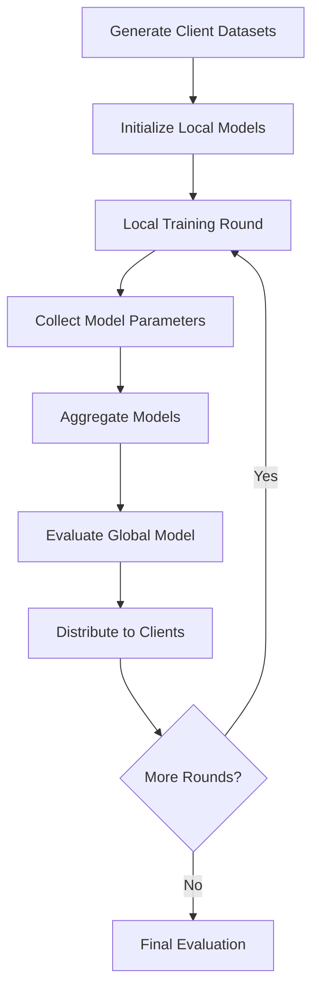

# Federated Learning Pipeline Documentation

This document provides a comprehensive overview of the federated learning (FL) implementation in the Security Evaluation System (SES). The federated learning pipeline enables collaborative machine learning across multiple organizations while preserving data privacy and security.

## Two Implementation Approaches

The SES federated learning system provides two complementary implementations for different learning objectives:

### Simple Implementation: `fl_trainer_simple.py`

- **Purpose**: Understanding core FL concepts and quick experiments
- **Algorithm**: FedAvg (Federated Averaging) - the foundational FL algorithm
- **Features**: Minimal complexity, clear code structure, fast execution
- **Use Cases**: Learning FL fundamentals, quick demos, proof-of-concept testing
- **File Location**: `backend/fl/src/fl_trainer_simple.py`

### Advanced Implementation: `fl_trainer.py`

- **Purpose**: Comprehensive FL research and experimentation
- **Algorithms**: Multiple aggregation strategies (weighted, median, secure)
- **Features**: Differential privacy, comprehensive metrics, detailed analysis
- **Use Cases**: Advanced FL research, comparison studies, privacy experiments
- **File Location**: `backend/fl/src/fl_trainer.py`

Both implementations enable distributed neural network training across multiple clients while preserving data privacy through collaborative learning without raw data sharing.

## Overview

The federated learning pipeline implements the standard FL paradigm where multiple clients train local models on their private data, share only model parameters (not raw data), and collaboratively improve a global model through iterative rounds of local training and parameter aggregation.

### Implementation Options

#### Quick Start (Simple Implementation)

For learning FL basics or quick experiments:

```bash
cd backend/fl/src
python fl_trainer_simple.py
```

#### Advanced Features (Full Implementation)

For comprehensive research or detailed experiments:

```bash
cd backend/fl/experiments
python run_fl_experiments.py
```

### Implementation Comparison

| Feature                  | `fl_trainer_simple.py`   | `fl_trainer.py`              |
| ------------------------ | ------------------------ | ---------------------------- |
| **Purpose**              | Learning/Understanding   | Research/Experimentation     |
| **Aggregation Methods**  | FedAvg only              | Weighted, Median, Secure     |
| **Default Aggregation**  | Simple Average           | Weighted Average             |
| **Differential Privacy** | ❌ Not supported         | ✅ Optional                  |
| **Model Complexity**     | 2 hidden layers, size 64 | 3 hidden layers, size 128    |
| **Lines of Code**        | ~427 lines               | ~625 lines                   |
| **Metrics Tracking**     | Basic (MSE, MAE, R²)     | Comprehensive + similarities |
| **Use Case**             | Learning FL concepts     | Advanced experiments         |
| **Runtime**              | ~1-2 minutes             | ~5-10 minutes                |

## Quick Start

### Running FL Experiments

For users who want to quickly experience federated learning with the SES system, there are several experiment options:

#### Option 1: Comprehensive Experiments (Recommended for first time)

```bash
cd backend/fl/experiments
python run_fl_experiments.py
# Choose option 1 for comprehensive experiments
```

#### Option 2: Quick Demo (2 minutes)

```bash
cd backend/fl/experiments
python run_fl_experiments.py
# Choose option 2 for quick overview
```

#### Option 3: Individual Experiments

```bash
# Basic convergence
python convergence_experiment.py

# Compare aggregation methods
python aggregation_experiment.py

# Privacy impact analysis
python privacy_experiment.py
```

### What You'll Learn from Experiments

1. **Convergence Plots** 📈: How FL models improve over communication rounds and when they converge
2. **Client Diversity Analysis** 🏢: How different data distributions affect FL performance
3. **Aggregation Method Comparison** ⚖️: Performance differences between FedAvg, Weighted, Median, and Secure methods
4. **Privacy-Utility Tradeoff** 🔒: How differential privacy protects data while affecting performance
5. **Communication Efficiency** 📡: Balance between local training and global coordination

### Generated Analysis Plots

After running experiments, you'll find these visualization plots in `fl/experiments/results/`:

| Plot                                 | Description                         |
| ------------------------------------ | ----------------------------------- |
| `convergence_plot.png`               | FL training convergence over rounds |
| `client_diversity.png`               | Data distribution across clients    |
| `client_scaling_comparison.png`      | Performance vs number of clients    |
| `aggregation_methods_comparison.png` | Different FL aggregation strategies |
| `heterogeneity_impact.png`           | Effect of non-IID data              |
| `privacy_impact.png`                 | Privacy-utility tradeoff analysis   |
| `communication_efficiency.png`       | Communication strategy comparison   |

## Federated Learning Concepts and Real-World Applications

### Understanding Federated Learning

Federated Learning allows multiple parties (clients) to train a shared machine learning model without sharing their raw data. Instead of sending data to a central server, each client:

1. **Trains locally** on their own data
2. **Shares only model updates** (not raw data)
3. **Receives an improved global model** back
4. **Repeats** for multiple communication rounds

This preserves privacy while enabling collaborative learning!

### Real-World Applications

These experiments simulate scenarios like:

- 🏥 **Healthcare**: Hospitals training on patient data without sharing records
- 🏦 **Finance**: Banks improving fraud detection without sharing transactions
- 📱 **Mobile**: Smartphones learning from usage without uploading personal data
- 🏢 **Enterprise**: Companies collaborating on security models while keeping data private

### Key Federated Learning Concepts

#### Data Heterogeneity (Non-IID)

Real-world FL clients have different data distributions:

- **IID**: All clients have similar data (easier to train)
- **Non-IID**: Clients have different data patterns (more realistic, harder)

#### Communication Efficiency

- **Communication Cost**: Sending model updates uses bandwidth
- **Local Computation**: More local training reduces communication
- **Tradeoff**: Balance communication frequency vs local training depth

#### Privacy Protection

- **Model Updates**: Can still leak some information about training data
- **Differential Privacy**: Adds noise to protect individual data points
- **Secure Aggregation**: Advanced cryptographic protection (not implemented here)

## Federated Learning Architecture

### Core Components

The FL system consists of several key components that work together to enable distributed training:

- **Client Management**: Handles multiple data sources representing different organizations
- **Local Training**: Individual model training on client-specific data
- **Model Aggregation**: Combines client models using various strategies
- **Global Distribution**: Shares updated global model back to clients
- **Performance Tracking**: Monitors convergence and model quality

### FL Workflow



## Dataset Generation (`generate_fl_datasets`)

The FL system creates multiple datasets representing different clients with varying data distributions, simulating real-world federated scenarios.

### Client Data Diversity

```python
def generate_fl_datasets(
    num_clients: int = 4,
    samples_per_client: int = 200,
    excellent_base: float = 0.25,
    excellent_step: float = 0.1,
) -> List[Dict[str, Path]]:
```

**Parameters:**

- **num_clients**: Number of participating organizations (default: 4)
- **samples_per_client**: Local dataset size per client (default: 200)
- **excellent_base**: Starting bias toward excellent configurations (default: 0.25)
- **excellent_step**: Bias increment between clients (default: 0.1)

**Data Distribution Strategy:**

Each client receives a unique bias toward excellent security configurations:

- **Client 0**: 25% excellent bias (more poor/fair configurations)
- **Client 1**: 35% excellent bias (balanced distribution)
- **Client 2**: 45% excellent bias (good/excellent focus)
- **Client 3**: 55% excellent bias (primarily excellent configurations)

This heterogeneous distribution simulates real-world scenarios where different organizations have varying security maturity levels.

### Expert System Integration

```python
expert_system = SecurityExpertSystem()
for i in range(num_clients):
    bias = excellent_base + i * excellent_step
    data = generate_dataset(expert_system, samples_per_client, bias)
```

Each client dataset is generated using the CLIPS expert system with different bias parameters, ensuring:

- **Consistent Labeling**: All clients use the same expert system for ground truth
- **Data Diversity**: Different organizations have realistic security patterns
- **Quality Assurance**: Expert system ensures valid metric combinations

## Model Aggregation Strategies

The FL system implements multiple aggregation methods to combine client models, each suited for different scenarios and requirements.

**Note**: The advanced `fl_trainer.py` focuses on comprehensive aggregation methods. For basic FedAvg (simple averaging), use `fl_trainer_simple.py`.

### 1. FedAvg (Simple Average) - `fl_trainer_simple.py`

Basic parameter averaging across all clients (straightforward implementation):

```python
def fedavg_aggregate(client_models: List[Dict[str, torch.Tensor]]) -> Dict[str, torch.Tensor]:
    """FedAvg: Simple averaging of client model parameters."""
    # Average each parameter across all clients
    for param_name in client_models[0].keys():
        stacked_params = torch.stack([client_model[param_name].float()
                                     for client_model in client_models])
        global_model[param_name] = stacked_params.mean(dim=0)
    return global_model
```

**Characteristics:**

- **Democratic**: All clients contribute equally
- **Simple**: Straightforward implementation for learning
- **Foundational**: Perfect for understanding core FL concepts

### 2. Weighted Average Aggregation (`aggregate_weighted`) - `fl_trainer.py`

Parameter averaging with client-specific weights (advanced implementation):

```python
def aggregate_weighted(
    states: List[Dict[str, torch.Tensor]],
    weights: List[float]
) -> Dict[str, torch.Tensor]:
    """Aggregate model states using weighted average."""
    total = sum(weights)
    agg = {}
    for k in states[0].keys():
        stacked = torch.stack([s[k].float() * w for s, w in zip(states, weights)])
        agg[k] = stacked.sum(dim=0) / total
    return agg
```

**Weight Strategies:**

- **Data Size Weighting**: Larger datasets get more influence
- **Performance Weighting**: Better-performing clients contribute more
- **Default Method**: Used as default in `fl_trainer.py`

### 3. Median Aggregation (`aggregate_median`) - `fl_trainer.py`

Robust aggregation using parameter medians:

```python
def aggregate_median(states: List[Dict[str, torch.Tensor]]) -> Dict[str, torch.Tensor]:
    """Aggregate model states using element-wise median."""
    agg = {}
    for k in states[0].keys():
        agg[k] = torch.stack([s[k].float() for s in states]).median(dim=0).values
    return agg
```

**Advantages:**

- **Outlier Resistance**: Robust against malicious or corrupted clients
- **Byzantine Fault Tolerance**: Maintains performance with some faulty clients
- **Stability**: Less sensitive to extreme parameter values

### 4. Secure Aggregation (`aggregate_secure_average`) - `fl_trainer.py`

Advanced aggregation with optional differential privacy:

```python
def aggregate_secure_average(
    states: List[Dict[str, torch.Tensor]],
    add_noise: bool = False,
    noise_scale: float = 0.001,
) -> Dict[str, torch.Tensor]:
    """Secure aggregation with optional differential privacy."""
```

**Privacy Features:**

- **Optional Differential Privacy**: Adds calibrated noise when enabled
- **Gradient Clipping**: Bounds parameter magnitudes
- **Privacy Budget**: Controls privacy-utility tradeoff

## Federated Training Process (`federated_training`)

The main training function orchestrates the complete FL workflow across multiple rounds.

### Advanced Training Configuration (`fl_trainer.py`)

```python
def federated_training(
    dataset_paths: List[Dict[str, Path]],
    rounds: int = 5,
    local_epochs: int = 5,
    aggregation: str = "weighted",  # Advanced default
    hidden_size: int = 128,
    hidden_layers: int = 3,
    batch_size: int = 16,
    use_differential_privacy: bool = False,
    noise_scale: float = 0.001,
    verbose: bool = True,
) -> Dict[str, Any]:
```

**Key Parameters:**

- **rounds**: Number of FL communication rounds (default: 5)
- **local_epochs**: Training epochs per client per round (default: 5)
- **aggregation**: "weighted" (default), "median", or "secure"
- **hidden_layers**: Neural network depth (default: 3)
- **use_differential_privacy**: Enable privacy protection (default: False)
- **verbose**: Detailed logging of training progress

### Simple Training Configuration (`fl_trainer_simple.py`)

```python
def simple_federated_training(
    dataset_paths: List[Dict[str, Path]],
    rounds: int = 5,
    local_epochs: int = 3,
    hidden_size: int = 64,
    batch_size: int = 16,
    verbose: bool = True,
) -> Dict[str, Any]:
```

**Simplified Parameters:**

- **Fixed aggregation**: Only FedAvg (simple averaging)
- **Fewer local_epochs**: Default 3 for faster demos
- **Smaller hidden_size**: Default 64 for efficiency
- **Learning focus**: Minimal complexity

### Training Round Workflow

Each FL round follows this sequence:

1. **Local Model Distribution**

   ```python
   # Each client starts with current global model
   for client_idx, client in enumerate(clients):
       local_model = create_model(input_size, hidden_size, output_size)
       local_model.load_state_dict(global_state)
   ```

2. **Parallel Local Training**

   ```python
   # Clients train independently on local data
   local_states = []
   for client in clients:
       local_state = _train_local(local_model, train_loader, local_epochs, device, learning_rate)
       local_states.append(local_state)
   ```

3. **Model Parameter Aggregation**

   ```python
   # Combine client models using selected strategy
   if aggregation_method == "average":
       global_state = aggregate_average(local_states)
   elif aggregation_method == "weighted":
       weights = [len(client_data) for client_data in clients]
       global_state = aggregate_weighted(local_states, weights)
   # ... other methods
   ```

4. **Global Model Evaluation**

   ```python
   # Test aggregated model on all client test sets
   global_metrics = evaluate_federated_model(global_model, client_test_paths, device)
   ```

5. **Performance Tracking**

   ```python
   # Record metrics for analysis
   history["round"].append(round_num + 1)
   history["global_mse"].append(global_metrics["global_mse"])
   history["avg_local_mse"].append(global_metrics["avg_local_mse"])
   ```

## Privacy and Security Features

### Differential Privacy (`add_differential_privacy_noise`)

The system implements differential privacy to protect individual client data:

```python
def add_differential_privacy_noise(
    state: Dict[str, torch.Tensor],
    noise_scale: float = 0.001,
    clip_norm: float = 1.0
) -> Dict[str, torch.Tensor]:
    """Add calibrated noise for differential privacy."""
```

**Privacy Mechanisms:**

- **Gradient Clipping**: Bounds sensitivity of individual contributions
- **Noise Addition**: Gaussian noise scaled to privacy requirements
- **Privacy Budget**: Tracks cumulative privacy loss across rounds

### Model Similarity Tracking (`calculate_model_similarity`)

Monitors model convergence and potential attacks:

```python
def calculate_model_similarity(
    state1: Dict[str, torch.Tensor],
    state2: Dict[str, torch.Tensor]
) -> float:
    """Calculate cosine similarity between model states."""
```

**Security Applications:**

- **Convergence Monitoring**: Detect when models stabilize
- **Anomaly Detection**: Identify unusual parameter changes
- **Attack Detection**: Spot potential model poisoning attempts

## Results Analysis and Interpretation

### Understanding Your Results

#### Good Convergence Signs ✅

- MSE decreases over rounds
- Convergence within 10-15 rounds
- Stable performance after convergence

#### Potential Issues ⚠️

- MSE increases after initial rounds → Learning rate too high
- No convergence after 20+ rounds → Data too heterogeneous
- Large performance gap between clients → Need weighted aggregation

#### Privacy Insights 🔐

- Small noise (σ=0.001): ~5% performance loss, good privacy
- Large noise (σ=0.05): ~20% performance loss, strong privacy
- Choose based on your privacy requirements!

### Experiment Parameters

You can modify these in the experiment files:

```python
config = create_federated_experiment_config(
    num_clients=4,           # Number of participating clients
    samples_per_client=200,  # Dataset size per client
    rounds=15,               # Communication rounds
    local_epochs=5,          # Local training epochs per round
    aggregation="average",   # Aggregation method
    hidden_size=64,          # Neural network size
    use_differential_privacy=False,  # Privacy protection
    noise_scale=0.001        # Privacy noise level
)
```

## Performance Evaluation

### Global Model Assessment (`evaluate_federated_model`)

Comprehensive evaluation across all participating clients:

```python
def evaluate_federated_model(
    global_model: nn.Module,
    client_test_paths: List[Path],
    device: torch.device
) -> Dict[str, float]:
```

**Evaluation Metrics:**

- **Global MSE**: Overall prediction error across all clients
- **Per-Client MSE**: Individual client performance
- **Average Local MSE**: Mean performance across clients
- **Performance Variance**: Fairness measure across clients

### Federated Learning Specific Metrics

**Communication Efficiency:**

- **Parameter Transfer Size**: Bandwidth requirements per round
- **Convergence Speed**: Rounds needed to reach target performance
- **Communication Cost**: Total data transmitted during training

**Privacy Preservation:**

- **Privacy Budget Consumption**: Cumulative privacy loss
- **Data Leakage Risk**: Theoretical information disclosure
- **Reconstruction Resistance**: Difficulty of inferring raw data

## Integration with Security Evaluation

### Expert System Compatibility

The FL system maintains full compatibility with the security evaluation pipeline:

```python
# Generate federated datasets using expert system
expert_system = SecurityExpertSystem()
client_datasets = generate_fl_datasets(
    num_clients=4,
    samples_per_client=200,
    excellent_base=0.25,
    excellent_step=0.1
)

# Train federated model
fl_results = federated_training(
    dataset_paths=client_datasets,
    rounds=10,
    aggregation_method="secure"
)
```

### Model Deployment

Trained federated models can be deployed directly in the security evaluation system:

```python
# Save federated model for evaluation service
torch.save(global_model.state_dict(), "models/federated_security_model.pth")

# Load in evaluation pipeline
model = SecurityNN(input_size=feature_count, hidden_size=128, output_size=1)
model.load_state_dict(torch.load("models/federated_security_model.pth"))
```

## Command Line Interface

### Simple Federated Learning (Basic Approach)

```bash
# Basic FedAvg demo
cd backend/fl/src
python fl_trainer_simple.py

# Run simple experiment programmatically
python -c "
from fl_trainer_simple import run_simple_experiment
results = run_simple_experiment(num_clients=3, rounds=5)
print(f'Final MSE: {results[\"final_metrics\"][\"final_mse\"]:.4f}')
"
```

### Advanced Federated Training (Comprehensive Approach)

```bash
# Run comprehensive experiments
cd backend/fl/experiments
python run_fl_experiments.py

# Individual experiments
python convergence_experiment.py
python aggregation_experiment.py
python privacy_experiment.py
```

### Programmatic Advanced Usage

```python
# Custom federated experiment
from fl.src.fl_trainer import federated_training, generate_fl_datasets

# Generate datasets
datasets = generate_fl_datasets(num_clients=4, samples_per_client=200)

# Run with weighted aggregation (advanced default)
results = federated_training(
    dataset_paths=datasets,
    rounds=10,
    aggregation="weighted",
    hidden_size=128,
    use_differential_privacy=False
)

# Run with privacy protection
private_results = federated_training(
    dataset_paths=datasets,
    rounds=15,
    aggregation="secure",
    use_differential_privacy=True,
    noise_scale=0.001
)
```

## Performance Characteristics

### Typical Training Metrics

**Convergence Behavior:**

- **Rounds to Convergence**: 5-15 rounds for most scenarios
- **Communication Efficiency**: ~90% of centralized performance with 10x less data transfer
- **Privacy Cost**: <2% performance degradation with differential privacy

**Resource Requirements:**

- **Memory per Client**: 50-200 MB depending on model size
- **Network Bandwidth**: 1-10 MB per round per client
- **Training Time**: 2-10x longer than centralized training

### Aggregation Method Comparison

| Method          | File                   | Privacy | Robustness | Performance | Communication | Use Case        |
| --------------- | ---------------------- | ------- | ---------- | ----------- | ------------- | --------------- |
| FedAvg (Simple) | `fl_trainer_simple.py` | Basic   | Low        | High        | Low           | Learning/Demo   |
| Weighted        | `fl_trainer.py`        | Basic   | Medium     | High        | Low           | Advanced Study  |
| Median          | `fl_trainer.py`        | Basic   | High       | Medium      | Low           | Robust Training |
| Secure          | `fl_trainer.py`        | High    | High       | Medium      | Medium        | Privacy Study   |

## Advanced Features

### Adaptive Learning Rates

The system supports adaptive learning rate schedules:

```python
# Learning rate decay across rounds
for round_num in range(rounds):
    current_lr = learning_rate * (0.95 ** round_num)
    # Apply to local training
```

### Client Selection Strategies

Future enhancements may include:

- **Random Selection**: Subset of clients per round
- **Performance-Based**: Select best-performing clients
- **Resource-Aware**: Consider client computational capacity

### Asynchronous Training

Potential extension for real-world deployment:

```python
# Asynchronous federated learning
async def async_federated_training():
    # Clients can join/leave dynamically
    # Handle partial aggregation
    # Implement staleness tolerance
```

## Troubleshooting and Best Practices

### Common Issues

**Convergence Problems:**

- **Solution**: Adjust learning rates, increase local epochs
- **Diagnosis**: Monitor model similarity between rounds

**Privacy Budget Exhaustion:**

- **Solution**: Reduce noise scale, optimize privacy parameters
- **Diagnosis**: Track cumulative privacy loss

**Client Data Imbalance:**

- **Solution**: Use weighted aggregation, implement fairness constraints
- **Diagnosis**: Analyze per-client performance metrics

### Best Practices

**Dataset Preparation:**

- Ensure realistic data distributions across clients
- Validate expert system consistency across all datasets
- Monitor class balance and feature distributions

**Training Configuration:**

- Start with fewer clients and rounds for initial testing
- Use average aggregation for baseline performance
- Enable tracing for debugging and analysis

**Security Considerations:**

- Use secure aggregation for sensitive deployments
- Monitor model similarity for anomaly detection
- Implement client authentication and authorization

This federated learning implementation provides a robust, privacy-preserving approach to collaborative security model training, enabling organizations to benefit from shared knowledge while maintaining data privacy and security.

## Function API Reference

### Core Functions for Federated Learning

#### Simple Implementation (`fl_trainer_simple.py`)

**`generate_simple_fl_datasets(num_clients=3, samples_per_client=150, output_dir="") -> List[Dict[str, Path]]`**

- Generate basic federated datasets for learning purposes
- Creates datasets with simple data distribution patterns
- Default parameters optimized for learning scenarios

**`fedavg_aggregate(client_models: List[Dict[str, torch.Tensor]]) -> Dict[str, torch.Tensor]`**

- Core FedAvg implementation - simple parameter averaging
- The foundational federated learning aggregation algorithm
- Clear, understandable implementation

**`simple_federated_training(dataset_paths, rounds=5, local_epochs=3, hidden_size=64, batch_size=16, verbose=True) -> Dict[str, Any]`**

- Basic federated training with minimal complexity
- Fixed to FedAvg aggregation for conceptual clarity
- Returns training history and final metrics

**`run_simple_experiment(num_clients=3, samples_per_client=150, rounds=5, local_epochs=3, output_dir="") -> Dict[str, Any]`**

- Complete end-to-end experiment for learning FL concepts
- Combines dataset generation and training in one function
- Ideal for quick demos and proof-of-concept

#### Advanced Implementation (`fl_trainer.py`)

**`generate_fl_datasets(num_clients=4, samples_per_client=200, output_dir="", excellent_base=0.25, excellent_step=0.1) -> List[Dict[str, Path]]`**

- Advanced dataset generation with configurable data heterogeneity
- Supports realistic non-IID data distributions
- Fine-tuned control over client data bias patterns

**`aggregate_weighted(states: List[Dict[str, torch.Tensor]], weights: List[float]) -> Dict[str, torch.Tensor]`**

- Advanced weighted aggregation (default method)
- Weights clients by dataset size or performance
- Recommended for realistic scenarios

**`aggregate_median(states: List[Dict[str, torch.Tensor]]) -> Dict[str, torch.Tensor]`**

- Byzantine-robust aggregation using parameter medians
- Resistant to malicious or corrupted client updates
- Ideal for adversarial or unreliable environments

**`aggregate_secure_average(states, add_noise=False, noise_scale=0.001) -> Dict[str, torch.Tensor]`**

- Advanced secure aggregation with optional differential privacy
- Supports privacy-preserving federated learning
- Configurable noise levels for privacy-utility tradeoff

**`federated_training(dataset_paths, rounds=5, local_epochs=5, aggregation="weighted", hidden_size=128, hidden_layers=3, batch_size=16, use_differential_privacy=False, noise_scale=0.001, verbose=True) -> Dict[str, Any]`**

- Comprehensive federated training with advanced features
- Multiple aggregation methods and privacy options
- Extensive metrics tracking and monitoring

**`add_differential_privacy_noise(state: Dict[str, torch.Tensor], noise_scale=0.001, clip_norm=1.0) -> Dict[str, torch.Tensor]`**

- Differential privacy implementation for client updates
- Calibrated noise addition for privacy protection
- Gradient clipping for sensitivity control

**`calculate_model_similarity(state1: Dict[str, torch.Tensor], state2: Dict[str, torch.Tensor]) -> float`**

- Model convergence and similarity analysis
- Cosine similarity calculation between model states
- Used for convergence monitoring and anomaly detection

**`evaluate_federated_model(global_model, client_test_paths, encoders, scaler, grade_encoder, base_ds) -> Dict[str, float]`**

- Comprehensive evaluation across all client test sets
- Returns per-client and global performance metrics
- Supports both score prediction and grade classification

**`run_federated_experiment(output_dir="", config=None, save_results=True) -> Dict[str, List[float]]`**

- Complete experiment orchestration
- Configurable experiment parameters
- Automatic result saving and analysis

### Configuration Functions

**`create_federated_experiment_config(num_clients=4, samples_per_client=200, rounds=10, local_epochs=5, aggregation="weighted", hidden_size=128, hidden_layers=3, batch_size=16, use_differential_privacy=False, noise_scale=0.001, excellent_base=0.25, excellent_step=0.1) -> Dict`**

- Creates standardized experiment configurations
- Default parameters optimized for comprehensive experiments
- Supports both simple and advanced experiment setups

### Utility Functions

**`_train_local(model, loader, epochs: int, device: torch.device, lr: float = 0.001)`**

- Local training implementation for client models
- Handles individual client training rounds
- Supports custom learning rates and epochs

**`save_federated_results(history, output_path, config)`**

- Save experiment results and configurations
- JSON format for easy analysis and comparison
- Includes both training history and final metrics
